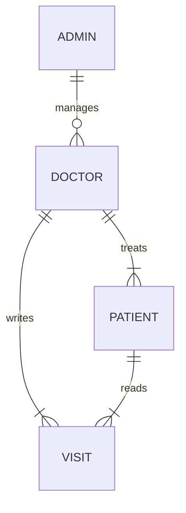

# Rocket EHR

This an (extremely basic and limited) electronic health records application
written in [Rocket](https://rocket.rs) for the RustLab workshop [Effective
Rocket]. It showcases making use of several of Rocket's unique features.
Notably:

  * Rocket's _guards_ to ensure 100% input validation.
  * _Request guard transparency_ to create type-level proofs of request-time conditions.
  * _Private cookies_ to confidentially store data client-side.
  * Rocket's _sentinels_ to catch runtime errors before your application starts.
  * Use Rocket's _async, real-time, typed streams_ to live-update client-side data.

[Effective Rocket]: https://rustlab.it/talks/effective-rocket-building-secure-blazing-fast-web-apps-with-confidence

## Scope

This application is designed only as an education tool. It is not designed to be
a comprehensive or feature-complete EHR solution. It is not designed to adhere
to or meet legal standards associated with managing patient data. It is not
intended to be used in production. Again, it is solely an educational tool.

The functionality implemented by this application consists of:



  * Health Records

  * Roles: administrators, doctors, and patients.

    _Admins_ have complete authority over the application. They may add doctors
    and patients and assign and re-assigned patients to doctors.

    _Doctors_ may see their patients and any of their patients visits.

    _Patients_ may see their doctor and their visits.

  * Records: Visits w/ notes.

# Getting Started

```
git clone https://github.com/SergioBenitez/RustLab2023.git
cd RustLab2023
export DATABASE_URL="sqlite:$(pwd)/db/db.sqlite"
cargo install sqlx-cli --no-default-features --features sqlite

cd db
cargo sqlx database create
cargo sqlx migrate run

cargo run
```

# License

This source code is licensed under the [GNU AGPLv3](LICENSE).

Unless you explicitly state otherwise, any contribution intentionally submitted
for inclusion in this project shall be licensed under the GNU AGPLv3 License,
without any additional terms or conditions.
